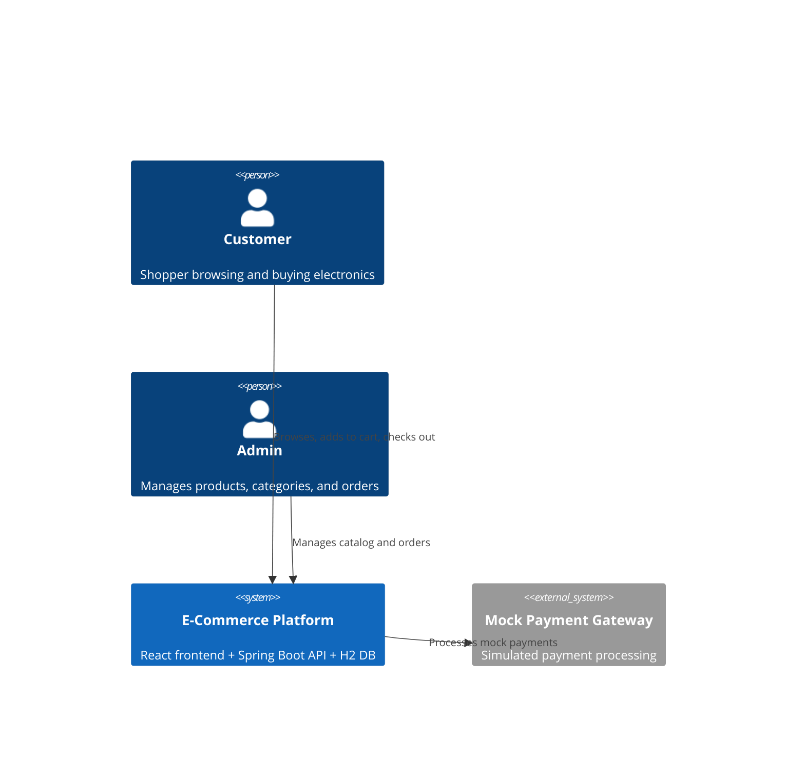
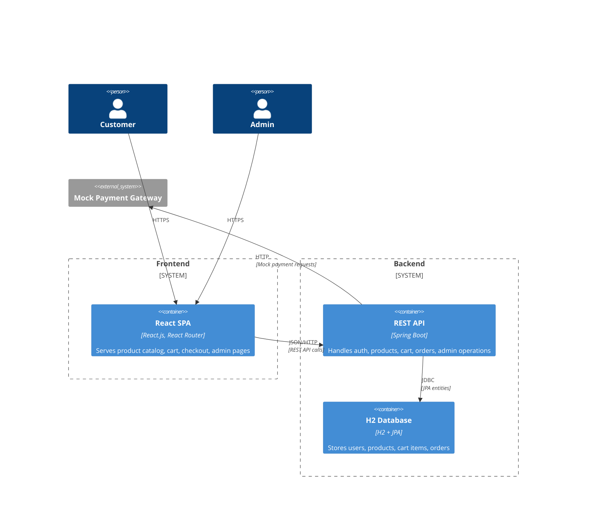
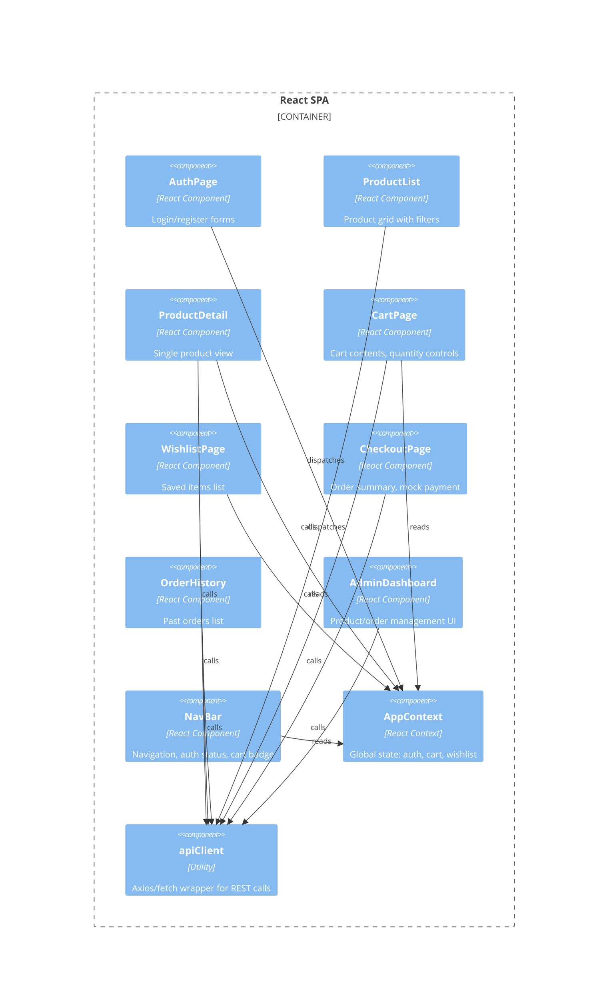

## Context

Greenfield e-commerce platform focused on electronics. React.js frontend communicates with a Java Spring Boot REST API backed by an H2 in-memory database. The platform supports user auth, product browsing, cart management, wishlist, checkout, order history, and an admin panel.

## Goals / Non-Goals

**Goals:**
- RESTful API design with clear separation of concerns
- Stateless authentication (JWT)
- H2 database for development with JPA entities
- Responsive React.js frontend
- Admin panel separate from user-facing UI, behind role-based access

**Non-Goals:**
- Production-grade database (H2 is for dev only)
- Real payment gateway integration (mock only)
- Horizontal scalability, load balancing, or container orchestration
- Mobile native apps

## Decisions

| Decision | Choice | Rationale | Alternatives Considered |
|---|---|---|---|
| Architecture | Layered REST API (Controller → Service → Repository) | Well-understood, testable, matches Spring Boot conventions | CQRS/Event Sourcing (overkill for this scope) |
| Auth | JWT (stateless) | No server-side session store needed; simple for single-server dev | Session cookies (requires session store) |
| Database | H2 with JPA/Hibernate | Zero setup for development; auto-DDL for rapid iteration | PostgreSQL (requires local install) |
| Frontend state | React Context + useReducer | Built-in, no extra deps for auth/cart/wishlist state | Redux (too heavy for this scope), Zustand (extra dep) |
| Admin panel | Same frontend app, role-gated routes | Single deployment, simpler code sharing | Separate admin SPA (more infra overhead) |
| API docs | OpenAPI / Swagger | Auto-generated from Spring Boot, easy frontend reference | Postman collection (manual maintenance) |

## System Context (C4 Level 1)



## Container Diagram (C4 Level 2)



## Component Diagram — Backend (C4 Level 3)

```mermaid
C4Component
  Container_Boundary(api, "REST API") {
    Component(authCtrl, "AuthController", "Spring REST", "Register, login endpoints")
    Component(prodCtrl, "ProductController", "Spring REST", "CRUD products, search, filter")
    Component(cartCtrl, "CartController", "Spring REST", "Add/remove/update cart items")
    Component(wishCtrl, "WishlistController", "Spring REST", "Add/remove wishlist items")
    Component(orderCtrl, "OrderController", "Spring REST", "Place orders, view history")
    Component(adminCtrl, "AdminController", "Spring REST", "Product/order management")

    Component(authSvc, "AuthService", "Java Service", "JWT token generation, password hashing")
    Component(prodSvc, "ProductService", "Java Service", "Product logic, search")
    Component(cartSvc, "CartService", "Java Service", "Cart business logic")
    Component(wishSvc, "WishlistService", "Java Service", "Wishlist business logic")
    Component(orderSvc, "OrderService", "Java Service", "Order placement, history")
    Component(adminSvc, "AdminService", "Java Service", "Admin operations")

    Component(userRepo, "UserRepository", "JPA Repository", "User CRUD")
    Component(prodRepo, "ProductRepository", "JPA Repository", "Product CRUD")
    Component(cartRepo, "CartRepository", "JPA Repository", "Cart CRUD")
    Component(wishRepo, "WishlistRepository", "JPA Repository", "Wishlist CRUD")
    Component(orderRepo, "OrderRepository", "JPA Repository", "Order CRUD")

    Rel(authCtrl, authSvc, "uses")
    Rel(prodCtrl, prodSvc, "uses")
    Rel(cartCtrl, cartSvc, "uses")
    Rel(wishCtrl, wishSvc, "uses")
    Rel(orderCtrl, orderSvc, "uses")
    Rel(adminCtrl, adminSvc, "uses")

    Rel(authSvc, userRepo, "queries")
    Rel(prodSvc, prodRepo, "queries")
    Rel(cartSvc, cartRepo, "queries")
    Rel(orderSvc, orderRepo, "queries")
    Rel(adminSvc, prodRepo, "queries")
    Rel(adminSvc, orderRepo, "queries")
    Rel(orderSvc, cartRepo, "reads")
  }

  Rel(api, db, "JDBC")
```

## Component Diagram — Frontend (C4 Level 3)



## Risks / Trade-offs

- **[Risk]** H2 data is lost on restart → **Mitigation**: Accept for dev; document that a production DB migration is needed later
- **[Risk]** JWT without refresh token rotation can't be revoked → **Mitigation**: Short token expiry (15 min) acceptable for dev scope
- **[Risk]** React Context re-renders with frequent cart/wishlist updates → **Mitigation**: Acceptable at this scale; memo + useCallback mitigate

## Migration Plan

Greenfield project — no migration needed. Both frontend and backend are built from scratch.

## Open Questions

None at this time.
